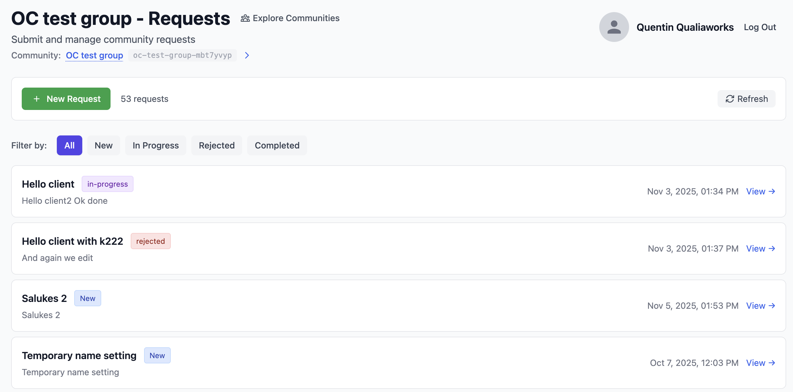
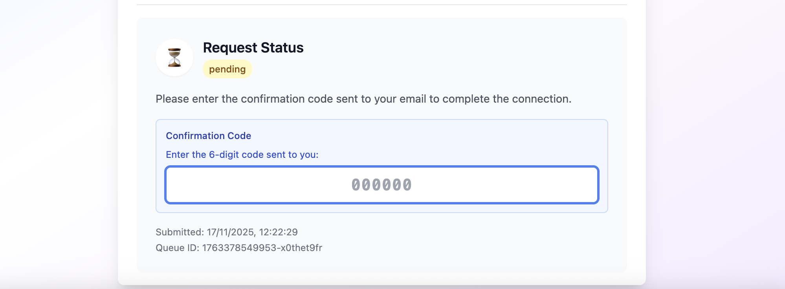
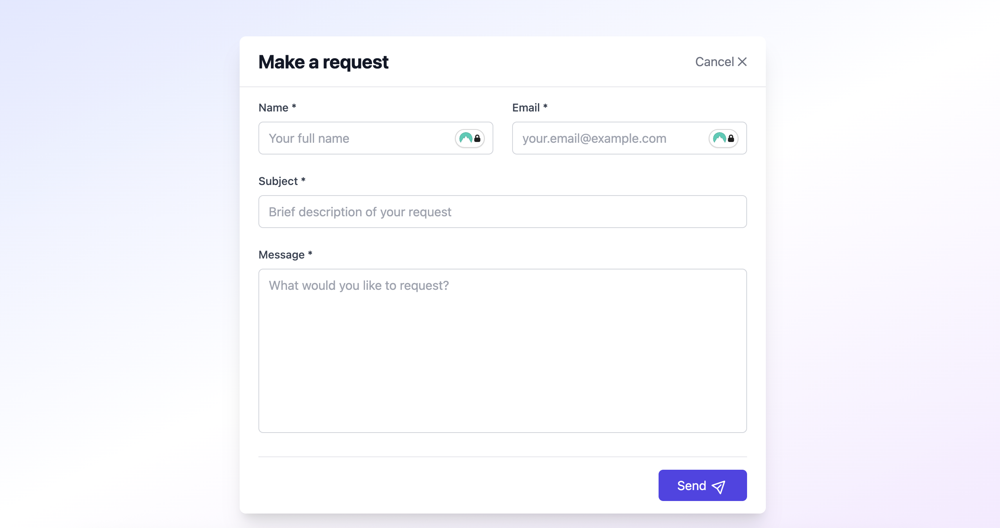
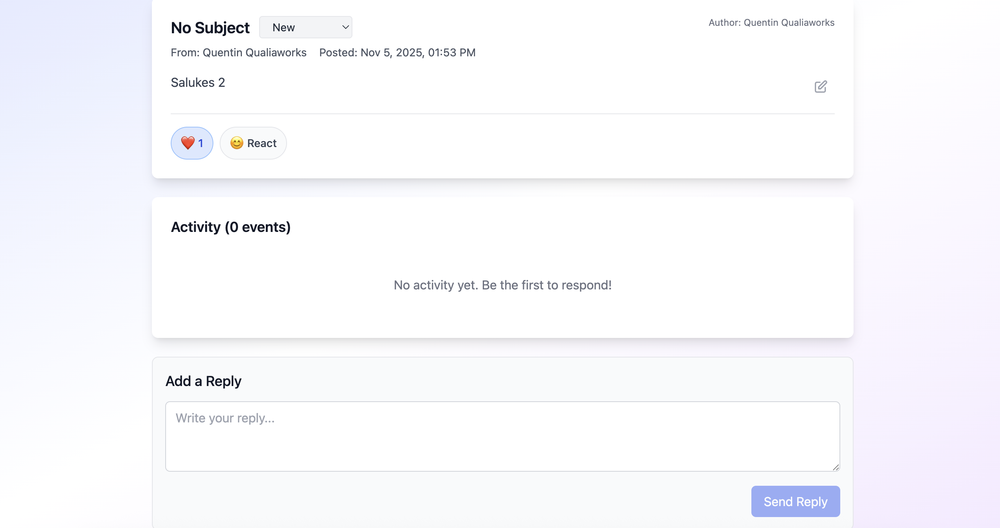

# Community Requests App

A React-based community request management system that uses OpenBunker for Nostr authentication and solely uses NOSTR as a backend.

## Getting Started

### Prerequisites

- Node.js 18+
- pnpm (recommended) or npm

### Installation

1. Clone the repository
2. Install dependencies:

   ```bash
   pnpm install
   ```

3. Start the development server:

   ```bash
   pnpm dev
   ```

4. Open [http://localhost:5173](http://localhost:5173) in your browser

See [docs](docs/DEVELOPMENT_SETUP.md) for more details

#### Embedding the Request Form

The request form can be embedded in other websites:

```html
<iframe
  src="http://localhost:5173/embed"
  width="100%"
  height="600px"
  frameborder="0"
>
</iframe>
```

## Deployment

### Build

Need to set up the environment. Copy the `.env.template` file to `.env` (for example `cp .env.template .env`) and fill in the required values before running:

```dotenv
# The url that will be opened when trying to authenticate with openbunker
VITE_OPENBUNKER_POPUP_URL=https://openbunker.opencollective.xyz/openbunker-login-popup?scope=community-requests
# The url that will be opened when trying to authenticate with openbunker (via e-mail confirmation)
VITE_OPENBUNKER_API_URL=https://openbunker.opencollective.xyz

# Scope used in OpenBunker (identities are scoped, allowing people to have one identity per scope and
# separating their identity across NOSTR apps)
VITE_OPENBUNKER_SCOPE=test-community-requests

# In NOSTR NIP-72, communities have both a long Community ID
# This is the default community that will be used as a landing page for the app
VITE_NOSTR_COMMUNITY_ID=bc072411cb5a2c5651c8a5cfd92975cef68c165928c5e98b0705edff4301b6db
VITE_NOSTR_COMMUNITY_IDENTIFIER=oc-test-group-mbt7yvyp
```

```bash
pnpm build
```

Artifacts in the `dist/` folder can then be used to serve the application.

## Dashboard

The main user page is User dashboard to manage requests and profile.



## Authentication

Authentication is needed to perform certain functions, including posting a request or a comment.
The app supports OpenBunker authentication. The application sends an API request to the `VITE_OPENBUNKER_API_URL` endpoint, and the user will subsequently have to confirm their login by using a one-time authentication code.



The NOSTR protocol side of this is implemented using `nostr-tools` and doesn't require any specific adjustments to the `NIP-46` protocol.

## Request Form

A user submits request to the request form :


The request form can be embedded in other websites via iframe

Requests can then be managed via the request detail page.




## Use of NOSTR and NIPS

All requests are stored and managed through Nostr relays.

The full list of NIPS used including new ones is outlined in [docs/NIP.md](docs/NIP.md).

## Contributing

1. Fork the repository
2. Create a feature branch
3. Make your changes
4. Add tests if applicable
5. Submit a pull request

## License

MIT License - see [LICENSE](LICENSE) file for details

## Support

For issues and questions:

- Open an issue on GitHub
- Check the [Nostr documentation](https://github.com/nostr-protocol/nips/tree/master)
- Review OpenBunker documentation on the [Openbunker Github](https://github.com/opencollective/openbunker)
