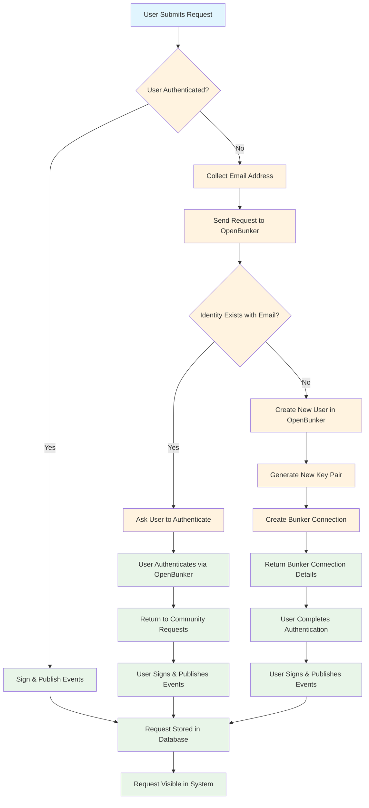

# Request Flow Diagram

This diagram shows the flow for handling requests in the community requests system, including both authenticated and unauthenticated user scenarios.

## Flow Description

### Authenticated User Path

1. **User Submits Request** → User is already authenticated
2. **Sign & Publish Events** → User signs the request with their Nostr key
3. **Request Stored** → Request is stored in the database
4. **Request Visible** → Request becomes visible in the community requests system

### Unauthenticated User Path

1. **User Submits Request** → User is not authenticated
2. **Collect Email** → System collects user's email address
3. **Send to OpenBunker** → Request is forwarded to OpenBunker service
4. **Check Identity** → OpenBunker checks if an identity exists for that email

#### If Identity Exists:

5. **Ask to Authenticate** → Prompt user to authenticate with existing account
6. **User Authenticates** → User completes authentication via OpenBunker
7. **Return to System** → User is redirected back to community requests
8. **Sign & Publish** → User can now sign and publish their request

#### If No Identity Exists:

5. **Create New User** → OpenBunker creates a new user account
6. **Generate Key Pair** → New Nostr key pair is generated
7. **Create Bunker Connection** → Bunker connection is established
8. **Return Connection Details** → Connection details are provided to user
9. **Complete Authentication** → User completes the authentication process
10. **Sign & Publish** → User can now sign and publish their request

## Key Benefits

- **Seamless UX**: Users can submit requests even without prior authentication
- **Identity Management**: OpenBunker handles user creation and key management
- **Security**: All requests are still cryptographically signed
- **Flexibility**: Supports both existing and new users
